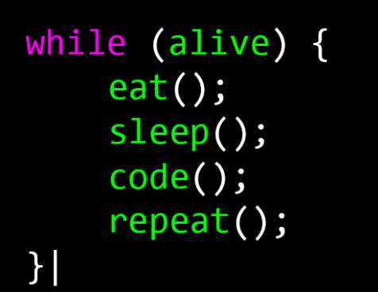

<!-- ## Hello There 👋☕ ## -->

<h1 align="center">
  <a href="https://git.io/typing-svg"></a>
    </h1>
<h3 align="center">| Java Developer ☕|</h3>
<br>
<div align="center" style="display: block;">
    
</div>

<br>

```yaml
👤 Name: Felipe Zanluca;
📚 Education: Graduated in Systems Analysis and Development from Uniavan University;
📍 Living: Itajaí - SC, Brazil;
💼 Work: Business Analyst at BRF S.A;
📧 Contact: felipezanluca@hotmail.com.

📖 A lifelong learner, passionate about continuously seeking knowledge and improving skills.

```
<hr>
<h3 align="center" > 
📚 Languages - Frameworks - Tools - Libraries - Workspace 📚 </h3>
<p align="center">
    

<!--
- 🔭 I’m currently working on ...
- 🌱 I’m currently learning ...
- 👯 I’m looking to collaborate on ...
- 🤔 I’m looking for help with ...
- 💬 Ask me about ...
- 📫 How to reach me:...
- 😄 Pronouns: ...
- ⚡ Fun fact: ...
-->

